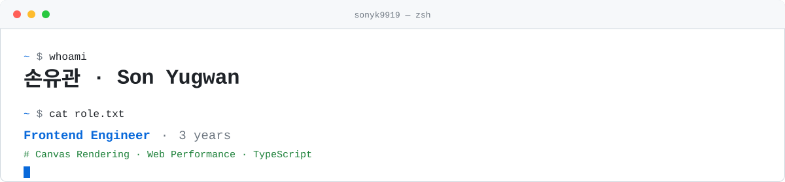

<picture>
  <source media="(prefers-color-scheme: dark)" srcset="./.github/assets/header-dark.svg">
  
</picture>

<a href="https://www.sonyk9919.store/">
  <picture>
    <source media="(prefers-color-scheme: dark)" srcset="./.github/assets/chip-portfolio-dark.svg">
    
  </picture>
</a>

<a href="mailto:sonyk9919@gmail.com">
  <picture>
    <source media="(prefers-color-scheme: dark)" srcset="./.github/assets/chip-email-dark.svg">
    
  </picture>
</a>

<a href="https://velog.io/@sonyk9919/posts">
  <picture>
    <source media="(prefers-color-scheme: dark)" srcset="./.github/assets/chip-velog-dark.svg">
    
  </picture>
</a>

 

### `~ $ cat career.log`

**이파피루스** &nbsp;`선임`&nbsp; · &nbsp;2024.03 – 2025.08

> 문서 뷰어·에디터 제품 개발

- Canvas 스프레드시트 뷰어 스크롤 지연 **1,500ms → 75ms** (벡터 요소가 많은 문서 기준 약 95% 감소)
- Decorator 기반 사용 통계 수집 모듈 설계 — 150여 개 기능 계측, **기존 코드 변경 0건**
- 서버 의존 없는 PDF 주석 편집 구현 — 클라이언트 단독 CRUD, Acrobat·Chrome 호환성 확보
- Cypress · Vitest 테스트 환경 신규 구축으로 30분 이상 걸리던 수동 QA 자동화

 

**리비바이오** &nbsp;`팀원`&nbsp; · &nbsp;2023.02 – 2024.03

> 의대·간호대생 학습 플랫폼 '알렌의 서재'

- 자체 커뮤니티 신규 구축 — **DAU 1,600 / MAU 15,000** 달성 (약 1개월)
- Core Web Vitals 개선 — Lighthouse **60 → 90점**
- 내부 CMS 구축 — 전자책 업로드 **30분 → 5분** (약 83% 단축)

 

> [!NOTE]
> 상세한 기술적 의사결정 과정은 **[포트폴리오 사이트](https://www.sonyk9919.store/)** 에 정리해두었습니다.

 

### `~ $ ls -la ./projects`

<table>
<tr>
<td width="33%" valign="top">

**[JobSync](https://github.com/sonyk9919/JobSync)**

공고 HTML을 드롭하면 마감일을 파싱해 Google Calendar에 등록하는 채용 일정 관리 도구

`Next.js` `TypeScript` `Zod`

[Demo](https://job-sync-five.vercel.app)

</td>
<td width="33%" valign="top">

**[수달](https://github.com/sudal-kgu)**

분리배출 가이드에 타이쿤 게임을 결합한 서비스 · 5인 팀 Project Lead, 클라이언트 전체 개발

`React` `Three.js` `Spring`

</td>
<td width="33%" valign="top">

**[3D Tetris](https://github.com/sonyk9919/3D-Tetris)**

Three.js로 구현한 아이소메트릭 시점의 3D 테트리스

`React 19` `Three.js` `GSAP`

[Demo](https://sonyk9919.github.io/3D-Tetris)

</td>
</tr>
</table>

 

### `~ $ tail -n 3 ./blog/posts`

- [크롤러 없이 채용공고 파싱하기](https://velog.io/@sonyk9919/%ED%81%AC%EB%A1%A4%EB%9F%AC-%EC%97%86%EC%9D%B4-%EC%B1%84%EC%9A%A9%EA%B3%B5%EA%B3%A0-%ED%8C%8C%EC%8B%B1%ED%95%98%EA%B8%B0)
- [XSS · CSRF 공격 원리와 방어 방법](https://velog.io/@sonyk9919/XSS-CSRF-%EA%B3%B5%EA%B2%A9-%EC%9B%90%EB%A6%AC%EC%99%80-%EB%B0%A9%EC%96%B4-%EB%B0%A9%EB%B2%95)
- [Spring Boot JWT 인증부터 OAuth · Google OTP · 2FA까지](https://velog.io/@sonyk9919/Spring-Boot-JWT-%EC%9D%B8%EC%A6%9D%EB%B6%80%ED%84%B0-OAuth-Google-OTP-2FA%EA%B9%8C%EC%A7%80)

 

### `~ $ cat education.txt`

<table>
<tr>
<td valign="middle">

**경기대학교** 컴퓨터공학과

`2020.03 – 2026.08 (졸업 예정)`

정보처리기사 `2025.12` &nbsp;·&nbsp; SQLD `2025.09`

</td>
<td valign="middle" align="right">

</td>
</tr>
</table>
